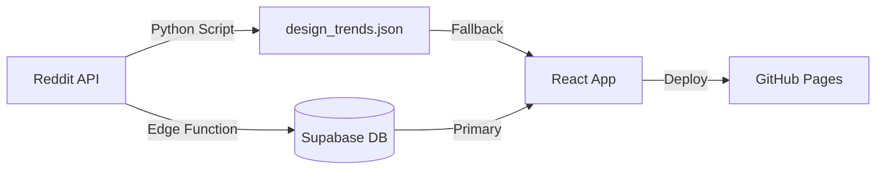

# 🎨 Design Trends

> Os melhores posts semanais das comunidades de design do Reddit — curados automaticamente.

**[🌐 Acesse o site ao vivo →](https://designtrends.ditr.studio)**

---

## 📖 Sobre o Projeto

**Design Trends** nasceu da vontade de acompanhar o que há de mais relevante no mundo do design sem precisar vasculhar dezenas de subreddits manualmente. O projeto coleta automaticamente os posts mais votados de comunidades de design no Reddit, organiza por categorias e apresenta tudo em uma interface editorial moderna.

### Categorias

| Categoria | Subreddits monitorados |
|-----------|----------------------|
| 🖥️ **UI/UX** | r/UIUX, r/UXDesign, r/UI_Design |
| 🎨 **Figma** | r/FigmaDesign |
| ✏️ **Design Gráfico** | r/graphic_design, r/Design, r/designBR |
| 🏭 **Design Industrial** | r/IndustrialDesign, r/3Dprinting, r/blender |
| 🌍 **Cultura** | Design no contexto cultural mais amplo |

---

## 🏗️ Arquitetura

```
design-trends/
├── execution/               # 🐍 Scripts Python de automação
│   └── check_design_trends.py   # Coleta posts do Reddit via API
├── supabase/                # 🗄️ Backend (Supabase)
│   ├── migrations/              # Schema SQL do banco de dados
│   └── functions/               # Edge Functions (fetch serverless)
├── web-app/                 # ⚛️ Frontend (React + Vite)
│   ├── src/
│   │   ├── components/          # Header, Footer, TrendCard, etc.
│   │   ├── pages/               # Home, Category, Post
│   │   ├── context/             # DataContext (Supabase + fallback local)
│   │   └── lib/                 # Tipos, categorias, cliente Supabase
│   └── public/
│       └── design_trends.json   # Dados locais (fallback)
└── .github/
    └── workflows/
        └── deploy.yml       # CI/CD: coleta + deploy automático
```

### Fluxo de dados



1. **Coleta** — Um script Python (`check_design_trends.py`) consulta a API pública do Reddit e busca os top posts da semana de cada subreddit.
2. **Armazenamento** — Os dados vão para o **Supabase** (PostgreSQL) e também são salvos em um JSON local como fallback.
3. **Exibição** — O frontend React consome os dados do Supabase (ou do JSON local se o Supabase estiver indisponível) e renderiza em uma interface editorial.
4. **Automação** — Uma **Supabase Edge Function** (`fetch-reddit`) roda semanalmente (via Cron Job), coletando novos dados, gerando resumos com IA e salvando no banco.

---

## 🛠️ Tecnologias

### Frontend
| Tecnologia | Versão | Uso |
|-----------|--------|-----|
| React | 19 | UI library |
| Vite | 7 | Build tool + dev server |
| TypeScript | 5.9 | Type safety |
| Tailwind CSS | 4 | Estilização (JIT via `@tailwindcss/vite`) |
| React Router | 7 | Navegação SPA |
| Lucide React | — | Ícones |

### Backend & Dados
| Tecnologia | Uso |
|-----------|-----|
| Supabase | Banco de dados PostgreSQL + autenticação |
| Reddit API | Fonte de dados (API pública, sem autenticação) |
| Python 3.11 | Script de coleta de dados |

### Infraestrutura
| Tecnologia | Uso |
|-----------|-----|
| Supabase Cron | Agendamento da coleta semanal |
| GitHub Pages | Hosting do frontend |

---

## 🚀 Como Rodar

### Pré-requisitos

- **Node.js** 18+
- **Python** 3.11+ (para o script de coleta)
- **npm** ou **pnpm**

### 1. Clone o repositório

```bash
git clone https://github.com/LuDittri/design-trends.git
cd design-trends
```

### 2. Configure as variáveis de ambiente

Crie um arquivo `.env` na raiz do projeto:

```env
# Supabase (opcional — o app funciona com dados locais)
VITE_SUPABASE_URL=https://seu-projeto.supabase.co
VITE_SUPABASE_ANON_KEY=sua-chave-anon-aqui
```

### 3. Instale as dependências do frontend

```bash
cd web-app
npm install
```

### 4. Rode o servidor de desenvolvimento

```bash
npm run dev
```

O site estará disponível em **http://localhost:3000**.

### 5. (Opcional) Colete dados frescos do Reddit

```bash
cd ..
pip install -r requirements.txt
python execution/check_design_trends.py
```

Os dados serão salvos em `web-app/public/design_trends.json`.

### 6. Build para produção

```bash
cd web-app
npm run build
```

Os arquivos estáticos serão gerados em `web-app/dist/`.

---

## 📄 Licença

Este projeto é de uso educacional e pessoal. Os dados exibidos pertencem aos seus respectivos autores no Reddit.

---

<p align="center">
  Feito com ☕ e curiosidade por <a href="https://github.com/LuDittri">Lucas Dittrich</a>
</p>
